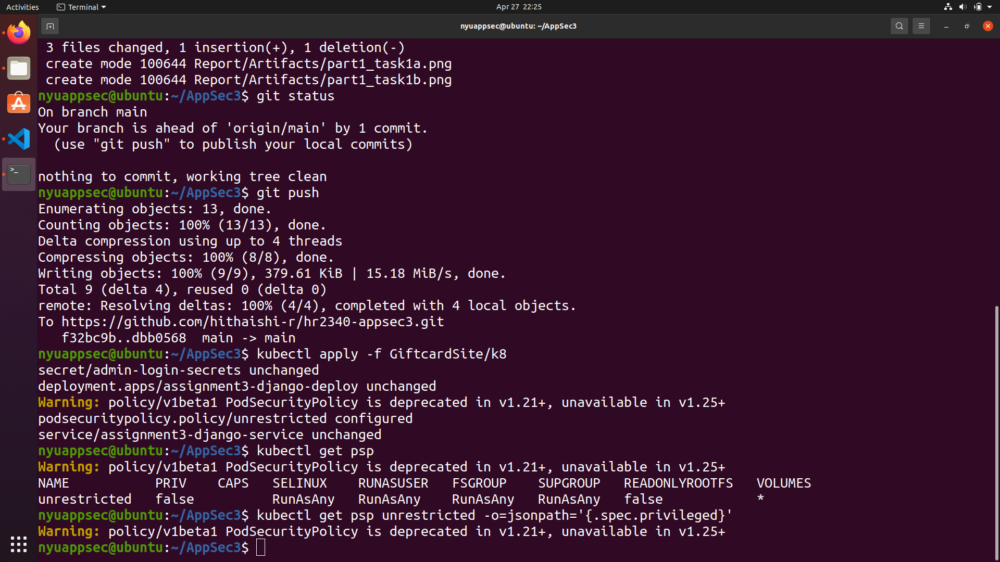
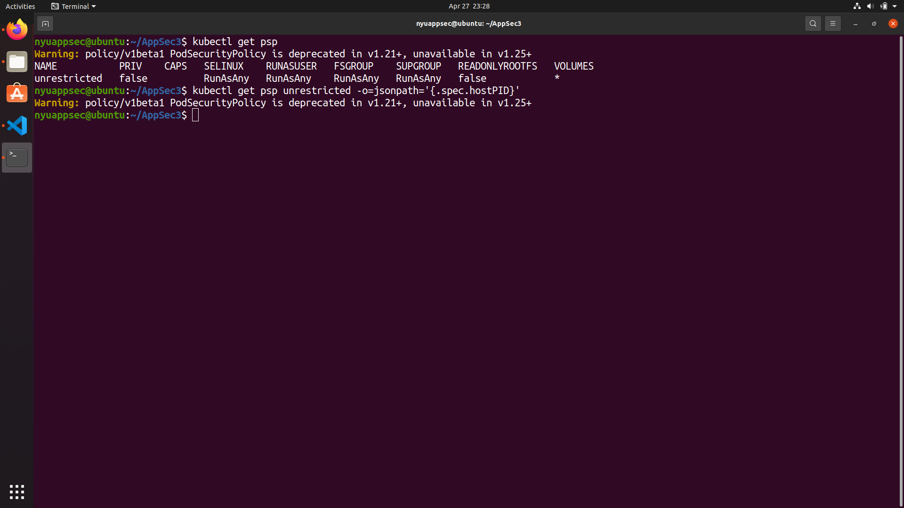
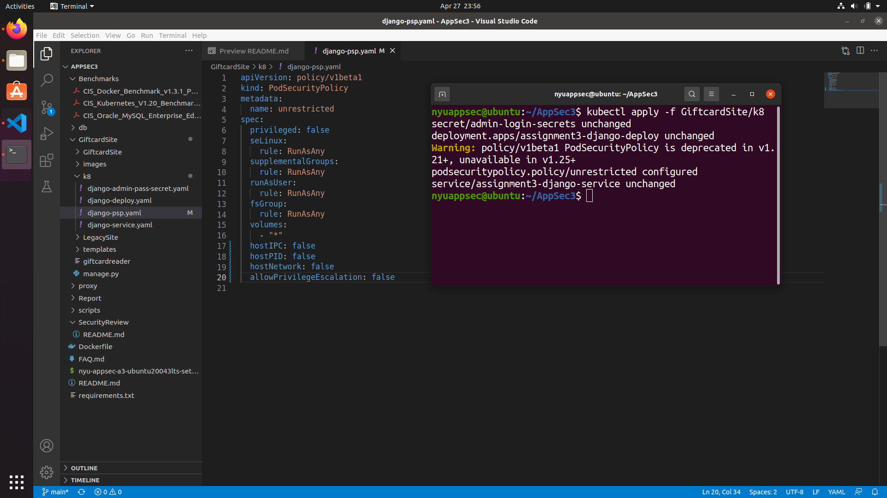
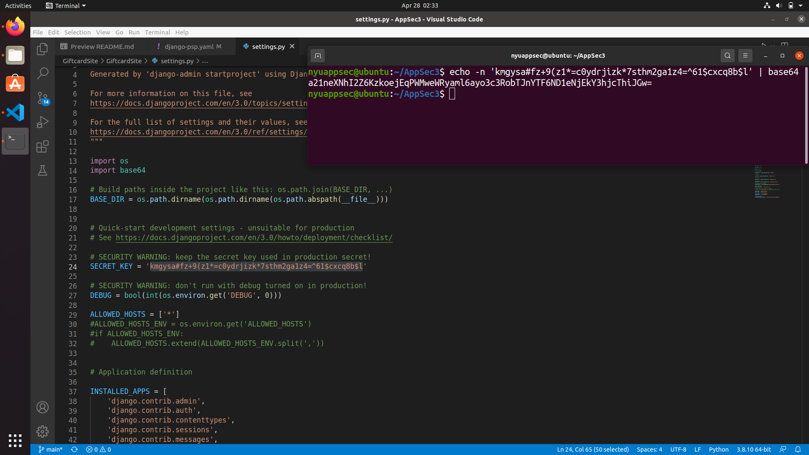

# Part 1 : Remediate Security Review Findings

## Task 1 : Kubernetes Control 5.2.1

### A) Validate findings
There must be at least one Pod Security Policy that does not permit privileged containers in this control. When we run the command ```kubectl get psp``` we can see a psp called unrestricted. Now we run the command ```kubectl get psp unrestricted -o=jsonpath='{.spec.privileged}'```  and see that it returns true. This means that the container has privileged premissions.


### B) Remediate
We need to create a PSP, ensuring that the .spec.privileged field is omitted or set to false in the ```django-psp.yaml``` file. To do this we update line 6 from true to false.


### C) Verify finding resolution
Now after the changes we will apply the new PSP by running the command ```kubectl apply -f GiftcardSite/k8```. Now we verify the fix by following steps of sub task A. Now we run the command ```kubectl get psp unrestricted -o=jsonpath='{.spec.privileged}'``` which does not return true. This shows that the container has privileged permissions.



## Task 2 : Kubernetes Control 5.2.2

### A) Validate findings
This control should have at least one PSP where the hostid value is not true. When we run the command ```kubectl get psp``` we can see a psp called unrestricted. Now we run the command ```kubectl get psp unrestricted -o=jsonpath='{.spec.hostPID}'``` which returns true. This means that the host process ID can share the namespace.


### B) Remediate
To remediate this failure, in the ```django-psp.yaml``` file we need to have the PSP hostPID set to false instead of true. This change is done in line 18 of the file. Now after the changes we will apply the new PSP by running the command ```kubectl apply -f GiftcardSite/k8```.


### C) Verify finding resolution
Now we verify the fix by following steps of sub task A. Now we run the command ```kubectl get psp unrestricted -o=jsonpath='{.spec.hostPID}'``` which does not return true. Hence fixed.



## Task 3 : Kubernetes Control 5.2.3

### A) Validate findings
This control should have at least one PSP where the hostid value is not true. When we run the command ```kubectl get psp``` we can see a psp called unrestricted. Now we run the command ```kubectl get psp unrestricted -o=jsonpath='{.spec.hostIPC}'``` which returns true. This means that the host IPC namespace can be shared.


### B) Remediate
To remediate this failure, in the ```django-psp.yaml``` file we need to have the PSP hostIPC set to false instead of true. This change is done in line 17 of the file. Now after the changes we will apply the new PSP by running the command ```kubectl apply -f GiftcardSite/k8```.


### C) Verify finding resolution
Now we verify the fix by following steps of sub task A. Now we run the command ```kubectl get psp unrestricted -o=jsonpath='{.spec.hostIPC}'``` which does not return true. Hence fixed.


## Task 4 : Kubernetes Control 5.2.4

### A) Validate findings
This control should have at least one PSP where the hostNetwork value is not true. When we run the command ```kubectl get psp``` we can see a psp called unrestricted. Now we run the command ```kubectl get psp unrestricted -o=jsonpath='{.spec.hostNetwork}'``` which returns true. This means that the site allows the sharing of a host network namespace.


### B) Remediate
To remediate this failure, in the ```django-psp.yaml``` file we need to have the PSP hostNetwork set to false instead of true. This change is done in line 19 of the file. Now after the changes we will apply the new PSP by running the command ```kubectl apply -f GiftcardSite/k8```.


### C) Verify finding resolution
Now we verify the fix by following steps of sub task A. Now we run the command ```kubectl get psp unrestricted -o=jsonpath='{.spec.hostNetwork}'``` which does not return true. Hence fixed.


## Task 5 : Kubernetes Control 5.2.5

### A) Validate findings
This control should have at least one PSP where the allowPrivilegeEscalation value is not true. When we run the command ```kubectl get psp``` we can see a psp called unrestricted. Now we run the command ```kubectl get psp unrestricted -o=jsonpath='{.spec.allowPrivilegeEscalation}'``` which returns true. This means that the site allows a container to escalate it's privileges.


### B) Remediate
To remediate this failure, in the ```django-psp.yaml``` file we need to have the PSP allowPrivilegeEscalation set to false instead of true. This change is done in line 20 of the file. Now after the changes we will apply the new PSP by running the command ```kubectl apply -f GiftcardSite/k8```.


### C) Verify finding resolution
Now we verify the fix by following steps of sub task A. Now we run the command ```kubectl get psp unrestricted -o=jsonpath='{.spec.allowPrivilegeEscalation}'``` which does not return true. Hence fixed.


## Task 6 : Kubernetes Control 5.2.6

### A) Validate findings
This control should have at least one PSP where it does not permit root users in a container. When we run the command ```kubectl get psp``` we can see a psp called unrestricted. Now we run the command ```kubectl get psp unrestricted -o=jsonpath='{.spec.runAsUser.rule}'``` which returns RunAsAny.


### B) Remediate
To remediate this failure, in the ```django-psp.yaml``` file we need to have the PSP runAsUser.rule set to MustRunAsNonRoot instead of RunAsAny. This change is done in line 12 of the file. Now after the changes we will apply the new PSP by running the command ```kubectl apply -f GiftcardSite/k8```.


### C) Verify finding resolution
Now we verify the fix by following steps of sub task A. Now we run the command ```kubectl get psp unrestricted -o=jsonpath='{.spec.runAsUser.rule}'``` which returns MustRunAsNonRoot. Hence fixed.


## Task 7 : Kubernetes Control 5.2.7

### A) Validate findings
This control should have at least one PSP where it prevents containers with the NET_RAW capability from launching. When we run the command ```kubectl get psp``` we can see a psp called unrestricted. Now we run the command ```kubectl get psp unrestricted -o=jsonpath='{.spec.requiredDropCapabilities}'``` which does not return anything. This means there is no policy that prevents containers with the NET_RAW capability from launching.


### B) Remediate
To remediate this failure, in the ```django-psp.yaml``` file we need to have a new PSP requiredDropCapabilities set to [NET_RAW]. This change is done in line 21 of the file. Now after the changes we will apply the new PSP by running the command ```kubectl apply -f GiftcardSite/k8```.


### C) Verify finding resolution
Now we verify the fix by following steps of sub task A. Now we run the command ```kubectl get psp unrestricted -o=jsonpath='{.spec.requiredDropCapabilities}'``` which returns ["NET_RAW"]. Hence fixed.


## Task 8 : Kubernetes Control 5.4.1

### A) Validate findings
This control should avoid exposing secrets as environment variables. We run the command ```kubectl get all -o jsonpath='{range .items[?(@..secretKeyRef)]} {.kind} {.metadata.name} {"\n"}{end}' -A``` which returns a few lines that means that the Django pod is using secrets exposed as enviornment variables.


### B) Remediate
When we open the settings.py file we find the secret key. We first use this key to create a base64 encoded key.


Now we use this key to build a Managed Secret Config file and we call it ```django-secret-key.yaml```. Then we modify the ```django-deploy.yaml``` file from line 47 to 52 to refer to this new secret key file.


We should not refer to the secret key directly in ```settings.py```. So in line 24 of the file we refer to an environment variable. Then we build the docker again using the command ```docker build -t nyuappsec/assign3:v0 .```. Then we apply the changes using the command ```kubectl apply -f GiftcardSite/k8```. Then we restart the pods to reflect the changes using the command ```kubectl rollout restart deployment assignment3-django-deploy```


### C) Verify finding resolution
First to see the pods that are running we use ```kubectl get pods```. Then we log into the pod ```assignment3-django-deploy``` using ```kubectl exec --stdin --tty assignment3-django-deploy-8975f66df-v2ztf -- sh```. This opens a shell where we can check for the existance of the secret key and we see that it is present.


## Task 9 : Kubernetes Control 5.7.1

### A) Validate findings
In this control we should create namespaces on our cluster to group related resources and isolate them from other resources. To check the namespaces we run the command ```kubectl get namespaces```, we can see that only standard namespaces are present.


### B) Remediate
To remediate this, we need to first create a namespace file called ```giftcardsite-namespace.yaml```. All the .yaml files must be in this newly creted namespace. So we add this new namespace under the metadata of every manifest file in ```db/k8```, ```GiftcardSite/k8``` and ```proxy/k8```. After that we need to reapply the deployments as shown in the screenshot.


### C) Verify finding resolution
When we run minikube service, we see that the mysql-service, assignment3-django-service, and proxy-service are in the "GiftcardSite" namespace and not "default" namespace. To . We can test our site by launching the service using ```minikube service proxy-service -n GiftcardSite``` and find that it is still working properly. Now to see the namespaces present we run the command ```kubectl get namespaces``` and we see the new namespace along with the others. Now to check which pods are running under which namespace we use the command ```kubectl get pods -A``` and find that the service is running under the new namespace.


## Task 10 : Kubernetes Control 5.7.2

### A) Validate findings
For this control we need to have seccomp profile set in all of the pods. We can validate this by using ```describe``` on each of the pods. There are 3 pods and none of them show the secure computing profile under its ```annotation``` as shown in the screenshot.


### B) Remediate
We add the seccomp profile to each of the deployment files for the pods. The files we need to modify are ```db-deployment.yaml```, ```django-deploy.yaml``` and ```proxy-depoy.yaml```. Then we reapply the deployments as shown in the screenshots.


### C) Verify finding resolution
We can verify the fix by using the command ```kubectl describe pod <pod_name>```. We can then see the presence of seccomp profile in the annotation section of each pod.


## Task 11 : Docker Control 4.1

### A) Validate findings
According to this control, the docker should not run as root user. When we run the command ```docker ps --quiet | xargs --max-args=1 -I{} docker exec {} cat /proc/1/status | grep -i 'name'``` we can see the names of the docker containers that are running. Then we can run the command ```docker ps --quiet | xargs --max-args=1 -I{} docker exec {} cat /proc/1/status | grep '^Uid:' | awk '{print $3}'``` which shows the uid of each docker. In the screenshot we see that there is one non root(non zero) and three containers running as root(0).


### B) Remediate
To remediate we need to make changes to the GiftcardSite and proxy pods to run as non root users. First we make changes in the docker file of the GiftcardSite, ```/Dockerfile```, by uncommenting the lines used to create a new user and we change the user to the new user that we created. Similarly for the proxy docker file, ```proxy/Dockerfile```, we need to change to the new user. Then we should restart the docker using the commands in the environment set up.


### C) Verify finding resolution
Now we can check for the UID of the pods using the commands in subtask A. We can see that there are three containers running as non root, and one running as root. This container is a kubernetes pod and not the website pod. This is shown in the screenshot below.


## Task 12 : Docker Control 4.2

### A) Validate findings
In this control, we need to make sure the containers use trusted images only. Our pods have the base images ```python:3.8-alpine``` for Django, ```mysql:latest``` for mySQL and ```nginxinc/nginx-unprivileged:1-alpine```. The 3.8-alpine image is in the official docker python page. The mySQL latest image is also present in the official docker mySQL page. The nginx image is not an official image but it is officially made by nginx inc and has over 50 million downloads. Hence all containers are using trusted images.
Additionally this control suggests that the DOCKER_CONTENT_TRUST should be enabled as this forces the docker to use trusted images only. By using the command ```printenv | grep 'DOCKER'```, we can see that there is no environment variable called ```DOCKER_CONTENT_TRUST```.


### B) Remediate
There is no remediation required for using trusted images since it has already been satisfied. But we need to enable the ```DOCKER_CONTENT_TRUST``` by using the command ```export DOCKER_CONTENT_TRUST=1``` and we also need to modify the nginx image that is used in the proxy since it is not an official image. We add ```FROM nginx:mainline-alpine``` instead of the former in the proxy docker file. Then we rebuild the docker.


### C) Verify finding resolution
Now we can check for the presence of the DOCKER_CONTENT_TRUST environment variable using the command ```printenv | grep 'DOCKER'``` and we see that the variable is set to 1.


## Task 13 : Docker Control 4.3

### A) Validate findings
According to this control our docker containers must install only required packages. We can ensure this by taking a look at the docker files for each of our pods. The docker files for mySQL and proxy does not contain any unnecessary packages but when we take a look at the GiftcardSite docker file, we can see that there are a few additional packages that are not required for our application such as the openjdk11 (JAVA) and mono (implementation of .NET).


### B) Remediate
To remediate we need to remove the lines that install the unnecessary packages in the dockerfile for the GiftcardSite. We comment out the lines that install openjdk11 and mono in the dockerfile. Next we rebuild the docker.


### C) Verify finding resolution
To verify our changes we check if the website is running after the rebuild and we can see that it is working.


## Task 14 : Docker Control 4.9
 
### A) Validate findings
According to this control we should use COPY instead of ADD in the docker files since ADD can pull remote code that is untrusted. To verify this we see the three docker files and find that GiftcardSite and MySQL Dockerfiles use ADD.


### B) Remediate
To remediate we need to change the lines from ADD to COPY in the docker files. Then we rebuild the docker containers and apply the changes.


### C) Verify finding resolution
To verify our changes we check if the website is running after the rebuild and we can see that it is working.


## Task 15 : Docker Control 4.10

### A) Validate findings
According to this control secrets shoud not be present in the docker files. When we see the docker files for mySQL, proxy and the GiftcardSite, there is a secret stored as a plaintext in the mySQL docker file. The other docker files donot have any secrets.


### B) Remediate
We can remediate this by using Kubernetes Managed Secrets with Configuration Files. At first, using the command ```echo -n 'thisisatestthing.' | base64``` we base64 encode the secret message. Then using this encoded message we create the Managed Secret Config file ```db-secret.yaml```. Then we modify the ```db-deployment.yaml``` to refer to this new secret and also remove the secret in the mySQL docker file. Then we rebuild the docker and apply the changes.


### C) Verify finding resolution
To verify we can see that there is no secret message as a plaintext in the docker files anymore. And the website still works fine.


## Task 16 : Oracle MySQL control 1.2

### A) Validate findings
According to this control we should use Dedicated Least Privileged Account for MySQL Service, in other words we need to make sure the mySQL pod runs as a non root. First we get a shell in the mySQL pod using the command ```kubectl exec --stdin --tty <mysql-podname> -- /bin/sh```. Then we try to run the suggested command ```ps -ef | egrep "^mysql.*$"``` and see that ps is not installed in the pod. We use the command ```apt-get update && apt-get install procps``` to install ps then we run ```ps -ef | egrep "^mysql.*$"``` again and we see that it runs as ```mysql``` user.


### B) Remediate
There is no remediation required.

### C) Verify finding resolution
Not needed.


## Task 17 : Oracle MySQL control 2.3

### A) Validate findings
According to this control, the mySQL service needs to run on a seperate pod of its own and not shared with other resources. We can validate this by using the command ```kubectl get pods -n <namespace>``` and we see that there is a seeprate container for mySQL.


### B) Remediate
Not required

### C) Verify finding resolution
not required.


## Task 18 : Oracle MySQL control 2.7

### A) Validate findings
According to this control, we need to ensure that the mySQL user passwords are set up to expire at least once a year. In order to check that we first get a shell in the mySQL pod using the command ```kubectl exec --stdin --tty <mysql-podname> -- /bin/sh```. Then we log into the mySQL database using the command ```mysql -u <username> -p```. Now we check if the ```default_password_lifetime``` is enabled using the command ```SELECT variable_name, variable_value FROM performance_schema.global_variables WHERE variable_name LIKE 'default_password_lifetime';``` and see that it is set to 0. Next we check the password lifetime of each user using the command ```SELECT user, host, password_lifetime FROM mysql.user;``` and see that all of them are set to NULL.


### B) Remediate
To remediate, inside the mySQL database we can run the commands ```set persist default_password_lifetime = 365;``` and ```ALTER USER 'root' PASSWORD EXPIRE INTERVAL 365 DAY;``` to set the default password and root password lifetime to 365.


### C) Verify finding resolution
We can verify the changes by using commands from subtask A and we see that the default password lifetime is 365 and root password is set to expire in 365 days.


## Task 19 : Oracle MySQL control 2.9

### A) Validate findings
According to this control, the mysql user passwords must not be reused unconditionally. For that we check of the variables ```password_history``` and ```password_reuse_interval``` are enabled. Inside the mysql database that we entered in the last task, we use the command ```SELECT variable_name, variable_value FROM performance_schema.global_variables WHERE variable_name IN ('password_history', 'password_reuse_interval');```, we see that the variables have values set to 0, meaning they are disabled.


### B) Remediate
We can remediate by setting the variable to a certain meaningful value. We use the commands ```SET PERSIST password_history = 5;``` and ```SET PERSIST password_reuse_interval = 365;``` to set the maximum number of password reuses (password_history) to 5 and the minimum time interval between the password reuse (password_reuse_interval) to 365 respectively.


### C) Verify finding resolution
We can verify the changes using the command from subtask A. We can see that the variables are enabled and the values are shown in the screenshot below.


## Task 20 - Oracle MySQL control 4.2

### A) Validate findings
According to this control, the database server should not have any example or test databases. To validate we run the command ```SELECT * FROM information_schema.SCHEMATA WHERE schema_name NOT IN
('mysql','information_schema', 'sys', 'performance_schema');```. We can see in the below screenshot that the only database present in the server is the website database, ```GiftcardSiteDB```. Hence this is a pass.


### B) Remediate
Not required

### C) Verify finding resolution
Not required


# Part 2

For this task we will automate the monitoring of two db controls from part 1 at regular intervals of one hour. But for testing purposes we set the interval for a minute. The two controls that we will be monitoring are ```Oracle MySQL control 2.7```(password lifetime) and ```Oracle MySQL control 2.9```(password reusability). In order to do that we need to set up cronjobs for each of the controls validation. The mysql host we have used in the yaml files is displayed when we use the command ```kubectl describe pod <mysql_pod_name>```. This files are shown in the screenshot below.


Then we build a mySQL config file and safely inject the kubernetes secret for the mysql server into the mysql command. After applying the yaml files using ```kubectl apply -f <file.yaml>```, we use the command ```kubectl get pods``` and we can see that the jobs are getting executed regularly with a minute of interval between the jobs.


Then to see the job logs we can use the commands ```kubectl logs <pod_name>```. The sucess output is shown in the screenshot below.


We have scheduled the monitoring interval to 1 minute for testing purposes by setting the schedule to ```"* * * * *"```. We then change it to 1 hour intervals for the actual problem by setting schedule to ```"0 * * * *"```. This means that the cronjobs are created at the 0th minute of every hour and a test is run for the controls that have been selected and it can be viewed using ```kubectl logs <pod_name>```.


	
	
	
